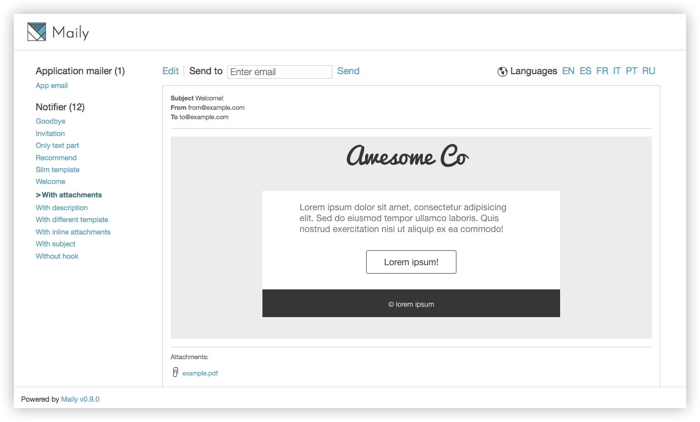

# Maily

[](http://badge.fury.io/rb/maily)

Stop to delivery emails every time you change it!

Maily is a Rails Engine to preview, follow up, test and edit the emails of your applications in the browser.

## Features:

* Mountable engine
* Visual preview in the browser (attachments as well)
* Template edition
* Email delivery
* Features configurables per environment
* Customizable parent controller (define permissions in your own controller)
* Minimalistic interface (thanks to [@gnatok](https://github.com/gnatok))
* Easy way (named hooks) to define data for emails
* Generator to handle a comfortable installation



## Installation
Add this line to you Gemfile:

```
gem 'maily'
```

Run generator:

```
rails g maily:install
```
 
This installator makes some tasks for you:

* Mounts the engine (to `/maily` by default) in your routes
* Adds an initializer (into `config/initializers/maily.rb`) to customize some settings  
* Adds a file (into `lib/maily_hooks.rb`) to define hooks 

## Initializer
You should configure Maily via this initializer. You can set these options per environment:

```ruby
  Maily.enabled = ENV['MAILY_ENABLED']
```

This is a sample of file with the full list of options:

```ruby
# config/initializers/maily.rb
Maily.setup do |config|
  # Enable/disable engine
  # config.enabled = Rails.env.production? ? false : true

  # Allow to edit templates
  # config.allow_edition = Rails.env.production? ? false : true

  # Allow deliveries
  # config.allow_delivery = Rails.env.production? ? false : true

  # Define I18n available locales
  # config.available_locales = [:en, :es, :pt, :fr]

  # Define parent controller. Allow to run engine under a custom controller
  # config.base_controller = 'AdminController'
end
```

## Hooks
Most of emails need to populate data to consume it and do intersting things. Hooks are used to define this data with a little DSL. Example:

```ruby
# lib/maily_hooks.rb
user = User.new(email: 'user@example.com')
comment = Struct.new(:body).new('Lorem ipsum') # stub way
service = Service.new(price: '100USD')

Maily.hooks_for('Notifier') do |mailer|
  mailer.register_hook(:welcome, user, template_path: 'users')
  mailer.register_hook(:new_comment, user, comment)
end

Maily.hooks_for('PaymentNotifier') do |mailer|
  mailer.register_hook(:invoice, user, service)
end
```

Note that you are able to override `template_path` like can be done in Rails. You must pass this option as a hash and last argument:

```ruby
Maily.hooks_for('YourMailerClass') do |mailer|
  mailer.register_hook(:your_mail, template_path: 'notifications')
end
```

## Notes
Rails 4.1 introduced a built-in mechanism to preview the application emails. It is in fact a port of [basecamp/mail_view](https://github.com/basecamp/mail_view) gem to the core.

Alternatively, there are some other plugins to get a similar functionality with different approaches. For example, [ryanb/letter_opener](https://github.com/ryanb/letter_opener) or [MailCatcher](https://github.com/sj26/mailcatcher).

## License
Copyright (c) 2013-2014 Marc Anguera. Maily is released under the [MIT](MIT-LICENSE) License.